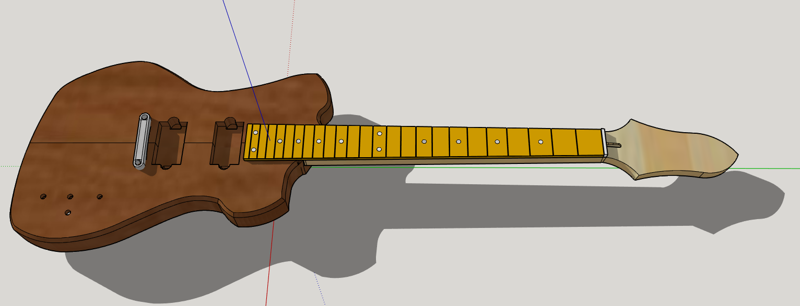

# Project News

3/8/26
I HAVE UPLOADED THE FIRST ROUND OF STL FILES AND THE MASTER SKP FILES FOR ALL TO ENJOY!

Please download the project and give feedback! I can only improve what I know.

## Change Log:

Things are uploaded. Try them. 

### Known Issues

Be sure to use a 2 degree shim on the neck if you use a TOM style bridge or Reddit will tell you all about it. :D


# EZO Venus De Milo Guitar Platform

Open Source Guitar Design for hobbyists and professional luthiers.  
CNC-first design, highly customizable.

---



An open source, CNC-first electric guitar platform designed for builders, makers, and digital fabrication workflows.

This project provides a modern bolt-on guitar design intended to be easy to manufacture with CNC routers while still remaining accessible to traditional woodworking tools.

The goal of the project is simple:

Create a guitar platform that anyone can build, modify, and improve.

---

## Project Goals

The EZO Venus De Milo was designed around several key principles:

• CNC-friendly geometry  
• Accessible shop tooling requirements  
• Repeatable machining setups  
• Open collaboration  
• Modular customization  

The design intentionally avoids features that require complex 3D surfacing or advanced CAM workflows so that builders using hobby CNC machines can successfully build the instrument.

---

## Core Specifications

Scale length: **25.5"**

Neck: **24 fret bolt-on neck**

Body type: **modern offset compact single cut**

Pickup configuration: **dual humbucker**

Bridge: **Tune-o-matic compatible geometry**

The neck and body were designed together to ensure proper alignment, scale placement, and CNC machinability.

---

## Builder Accessibility

The body dimensions were intentionally designed so that body blanks can be prepared using commonly available woodworking tools.

Specifically, the body blank can be processed using **12.5 inch planers**, which are widely used by hobby builders and small workshops.

This allows builders to prepare their own blanks without requiring industrial equipment.

---

## CNC Workflow Design

This project was designed with CNC workflows in mind.

Features included in the design:

• Precise neck pocket geometry  
• Repeatable CNC reference points  
• Simplified toolpath requirements  
• Minimal reliance on complex surfacing operations  

The goal is to make the guitar reliable to machine on hobby CNC routers such as:

• Shapeoko  
• FoxAlien  
• Onefinity  
• DIY routers  

Traditional builders can also use templates or manual routing methods.

Traditional routing templates will also be provided for builders who prefer a more traditional workflow.

---

## Neck and Fretboard Alignment

To simplify neck construction and machining, the design includes **registration marks**.

These are located on:

• The **top surface of the neck blank**  
• The **underside of the fretboard**

These reference points assist with:

• Fretboard glue-up alignment  
• CNC setup consistency  
• Repeatable machining operations

---

## Open Source Philosophy

This project is released as **open hardware**.

Anyone is free to:

• Download the design files  
• Build the guitar  
• Modify the design  
• Create derivative versions  

Builders are encouraged to experiment and share improvements.

If you create modifications or improvements, please share them with the community under the same open license.

This project is intended to serve as a foundation for experimentation in modern guitar design. Builders are encouraged to adapt the platform for new pickup configurations, scale lengths, and hardware systems.

---

## Commercial Use

Commercial production of guitars based on this platform is permitted.

However, commercially produced instruments must include **visible attribution to EZO**.

The **EZO logo must appear on both:**

• The neck  
• The body  

This requirement ensures proper credit for the original platform design.

I recommend placing the EZO logo on the **backside of the instrument** so builders can maintain their own branding on the front.

Personal builds are completely unrestricted. If you build one, a mention of the project is appreciated to help increase visibility.

---

## Branding and Trademarks

The **EZO name and logo remain the property of EZO Guitars of Vermont.**

The logo may be used for attribution as described in the license.

Use of the EZO brand in a way that implies official endorsement or manufacturer status is not permitted without permission.

Example acceptable usage:

"Built on the EZO Venus De Milo platform"

Example not permitted:

"EZO Model X"

---

## Accessory Ecosystem

One goal of this project is to create a platform for modular components.

This includes parts such as:

• Control cavity covers  
• Pickup rings  
• Truss rod covers  
• Decorative plates  
• Electronics mounts  

These parts can be produced using **3D printing, CNC machining, or other fabrication methods**.

Accessory files will also be released alongside the platform, and official EZO accessories may be offered separately.

Standardized mounting patterns are provided to encourage compatibility and interoperability.

---

## Repository Structure

```
/STL Files
STL Files of body, neck, and fretboard. Ready for 3d printing or even your own CAM endeavors.


/cnc
Reference geometry and machining notes. COMING SOON!


/branding
EZO logo and attribution assets.


/docs
Build documentation and notes. Also includes SKP Files of body, neck and fretboard.
```

---

## Community Builds

If you build a Venus De Milo guitar, please share photos.

Community builds help improve the platform and inspire new builders.

---

## License

This project is released under the **EZO Open Guitar Platform License**.

See the LICENSE file for full details.

---

## Final Thoughts

This project exists to encourage experimentation and collaboration in modern guitar design.

CNC and digital fabrication tools allow builders to approach instrument making in new ways.

The EZO Venus De Milo platform is intended to be a foundation for that exploration.

Build one. Modify it. Improve it. Share what you learn.
