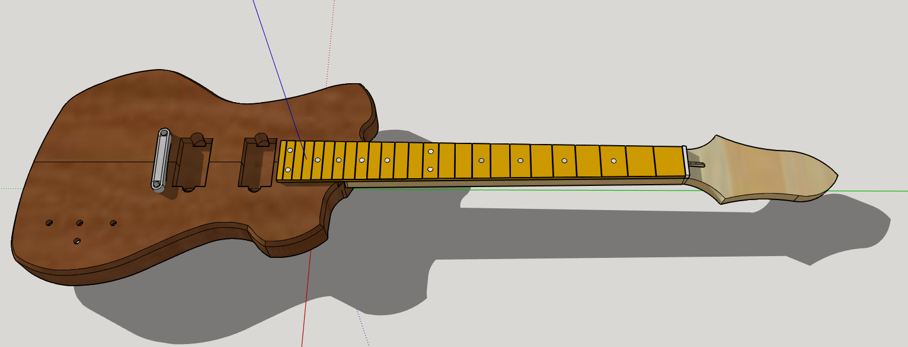

# EZO Venus De Milo Guitar Platform

Open-source guitar design for hobbyists and professional luthiers.  
CNC-first, highly customizable, and designed to remain approachable with common shop tools.



The **EZO Venus De Milo (VDM)** is an open hardware electric-guitar platform built around repeatable geometry, accessible fabrication, and community modification.

The goal is simple:

> Create a guitar platform that anyone can build, modify, and improve.

---

## Project News

### 2026-07-25

A major file reorganization added and updated body variants, router templates, drill guides, assembly references, and STL assets.

Recent additions include tooling developed during construction of a Venus De Milo bass, including:

- Seymour Duncan SSB-4 pickup routing templates
- Hipshot A-Style .750 bass bridge installation / drill-guide geometry
- Updated CAD organization under `docs/`
- Expanded body, neck, fretboard, and template assets

More changes are coming as shop-built parts are tested and refined.

### 2026-03-08

The first round of STL files and master SketchUp files was uploaded for builders to test and modify.

Feedback is welcome. Real-world builds are one of the best ways to improve the platform.

---

## Current Status

The VDM platform is actively developed. Some files are production-tested while others remain reference geometry, prototypes, or works in progress.

Before machining an expensive blank, **verify dimensions, hardware compatibility, scale placement, and toolpaths against your specific build and hardware**.

### Known Build Note

If you are using Tune-o-matic-style bridge geometry, account for the required neck angle. Current reference assemblies include versions using approximately a **2° neck tilt**.

Or Reddit will tell you all about it. :D

---

## Project Goals

The Venus De Milo platform is designed around several principles:

- CNC-friendly geometry
- Accessible shop tooling requirements
- Repeatable machining setups
- Open collaboration
- Modular customization
- Useful reference geometry for traditional template routing
- Design files that builders can inspect and modify

The project intentionally tries to avoid unnecessary manufacturing complexity so that builders using hobby CNC routers, 3D printers, and traditional woodworking tools can participate.

---

## Core Guitar Specifications

| Specification | Core VDM |
| --- | --- |
| Scale length | 25.5 in |
| Neck | 24-fret bolt-on |
| Body | Modern offset compact single-cut |
| Pickup configuration | Dual humbucker reference layout |
| Bridge geometry | Tune-o-matic compatible reference geometry |
| Manufacturing focus | CNC-first / template-friendly |

The neck, fretboard, and body are designed as a related system so builders can retain alignment and scale relationships while creating derivatives.

---

## Builder Accessibility

The body dimensions were intentionally kept compatible with commonly available woodworking equipment.

A VDM body blank can be prepared using a **12.5-inch planer**, avoiding the need for unusually large industrial surfacing equipment.

The platform supports several fabrication approaches:

- Hobby CNC routing
- Traditional router templates
- 3D-printed tooling and guides
- Hybrid digital / hand-tool workflows

---

## CNC Workflow Design

The project was developed with hobby-class CNC machines in mind, including machines from families such as:

- FoxAlien
- Shapeoko
- Onefinity
- DIY and custom routers

Design priorities include:

- Precise neck-pocket geometry
- Repeatable reference and registration features
- Simplified toolpath strategies where practical
- Geometry that can be converted into shop templates
- Reduced dependence on complex 3D surfacing for basic construction

The repository contains reference CAD, STL exports, and developing CNC/tooling resources. Always generate and verify CAM for your own machine, tooling, workholding, and stock.

---

## Neck and Fretboard Alignment

The design uses registration geometry to simplify neck construction and machining.

Reference points are provided on the neck and fretboard geometry to assist with:

- Fretboard glue-up alignment
- CNC setup consistency
- Repeatable machining operations
- Template registration

---

## Repository Structure

```text
/
├── 3dPrinting/
│   └── Notes and future 3D-print-specific resources
│
├── branding/
│   └── EZO attribution and logo assets
│
├── cnc/
│   └── CNC-specific notes and developing machining resources
│
├── docs/
│   ├── Assembly References/
│   ├── STL Files/
│   │   ├── body/
│   │   └── neck/
│   ├── Templates/
│   └── SketchUp CAD and reference geometry
│
├── images/
│   └── Project imagery used by the documentation
│
├── CONTRIBUTING.md
├── LICENSE.TXT
└── README.md
```

### `docs/`

The main engineering-data area of the repository. It contains SketchUp source/reference files, body and neck variants, assembly references, STL exports, router-template geometry, and hardware-layout tooling.

### `docs/Templates/`

Contains builder tooling and template CAD, including routing and hardware-placement guides. Some templates originate from real shop builds and may target specific third-party hardware.

### `docs/STL Files/`

Mesh exports derived from project CAD. Because source CAD continues to evolve, check that an STL matches the revision you intend to build before printing or machining from it.

### `branding/`

Contains EZO logo assets intended for attribution where required by the project license.

### `cnc/`

Reserved for CNC workflow notes, reference machining information, and related resources as they are developed.

### `3dPrinting/`

Reserved for 3D-print-specific notes, tooling, fixtures, and fabrication resources as they are developed.

---

## Accessory and Tooling Ecosystem

The VDM is intended to become more than a single guitar model. The platform can support interoperable parts and builder tooling such as:

- Control-cavity covers
- Pickup rings and mounting systems
- Truss-rod covers
- Decorative plates
- Electronics mounts
- Routing templates
- Bridge layout and drill guides
- Registration aids and fixtures

These components may be produced with 3D printing, CNC machining, or conventional shop methods.

---

## Open Hardware Philosophy

Builders are encouraged to:

- Download the design files
- Build instruments from the platform
- Modify the geometry
- Create derivative versions
- Develop compatible tooling and accessories
- Share useful improvements with the community

The VDM is intended to be a foundation for experimentation rather than a locked-down recipe.

---

## Commercial Use

Commercial production based on the platform is permitted subject to the **EZO Open Guitar Platform License**.

Commercial builders must follow the attribution requirements defined in `LICENSE.TXT`, including the required EZO identification on applicable instruments.

The EZO name and logo remain the property of **EZO Guitars of Vermont**. Attribution does not imply that a derivative instrument is manufactured, approved, or endorsed by EZO unless separate permission has been granted.

Example acceptable wording:

> Built on the EZO Venus De Milo platform

Do not market an independent derivative in a way that falsely represents it as an official EZO-manufactured model.

For the complete legal terms, **read `LICENSE.TXT` rather than relying on this summary**.

---

## Contributing

Contributions, experiments, fixes, documentation improvements, new tooling, and compatible derivatives are welcome.

Please read [`CONTRIBUTING.md`](CONTRIBUTING.md) before submitting changes.

Useful contributions include:

- Verified dimensions
- Build notes
- Template improvements
- Hardware compatibility findings
- CAD corrections
- CNC workflow documentation
- Photos and notes from completed builds

If something fails, document that too. Failed approaches are often extremely useful to the next builder.

---

## Community Builds

If you build a Venus De Milo, share what you learned.

Photos, manufacturing notes, hardware choices, modifications, and unexpected problems all help turn the platform into a better reference for future builders.

---

## License

This project is released under the **EZO Open Guitar Platform License**.

See [`LICENSE.TXT`](LICENSE.TXT) for the complete license and attribution requirements.

---

## Final Thoughts

Modern CNC routers, 3D printers, CAD tools, and traditional woodworking equipment give small shops and individual builders capabilities that once belonged almost exclusively to factories.

The Venus De Milo exists to explore what happens when those capabilities are shared openly.

**Build one. Modify it. Improve it. Share what you learn.**
